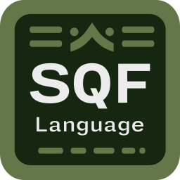

# SQF Language

This extension integrates the SQF Language into Visual Studio Code.
For more information please visit the [wiki](https://community.bistudio.com/wiki/).

This is a fork of [Armitxes/VSCode_SQF](https://github.com/Armitxes/VSCode_SQF), updated for more recent of ArmA 3. See the [latest release on Github](https://github.com/blackfisch/VSCode_SQF/releases/latest) for information on which versions are currently supported.

## Supported Products

* Operation Flashpoint [OFP & OFP Elite]
  * Enable/Disable commands from OFP via "sqf.enableOFP". Default: `enabled` (needed for all futher ArmA versions)
  * [Wiki: OFP Commands](https://community.bistudio.com/wiki/Category:Operation_Flashpoint:_Scripting_Commands)
  * [Wiki: OFP: Elite Commands](https://community.bistudio.com/wiki/Category:Operation_Flashpoint:_Elite:_Scripting_Commands)
* Take On Helicopters [ToH]
  * Enable/Disable commands from ToH via "sqf.enableTOH". Default: `disabled`
  * [Wiki: ToH Commands](https://community.bistudio.com/wiki/Category:Take_On_Helicopters:_Scripting_Commands)
  * [Wiki: ToH Functions](https://community.bistudio.com/wiki/Category:Take_On_Helicopters:_Functions)
* Armed Assault [ArmA]
  * Enable/Disable commands from ArmA via "sqf.enableARMA". Default: `enabled` (needed for all futher ArmA versions)
  * [Wiki: ArmA Commands](https://community.bistudio.com/wiki/Category:ArmA:_Armed_Assault:_Scripting_Commands)
  * [Wiki: ArmA Functions](https://community.bistudio.com/wiki/Category:ArmA:_Armed_Assault:_Functions)
* Armed Assault 2 & Operation Arrowhead [ArmA 2 & ArmA 2: OA]
  * Enable/Disable commands from ArmA 2 via "sqf.enableARMA2". Default: `enabled` (needed for all futher ArmA versions)
  * [Wiki: ArmA 2 Commands](https://community.bistudio.com/wiki/Category:Arma_2:_Scripting_Commands)
  * [Wiki: ArmA 2 Functions](https://community.bistudio.com/wiki/Category:Arma_2:_Functions)
  * [Wiki: ArmA 2: OA Commands](https://community.bistudio.com/wiki/Category:Arma_2:_Operation_Arrowhead:_Scripting_Commands)
  * [Wiki: ArmA 2: OA Functions](https://community.bistudio.com/wiki/Category:Arma_2:_Operation_Arrowhead:_Functions)
* Armed Assault 3 [ArmA 3]
  * Enable/Disable commands from ArmA 3 via "sqf.enableARMA3". Default: `enabled` (needed for all futher ArmA versions)
  * [Wiki: ArmA 3 Commands](https://community.bistudio.com/wiki/Category:Arma_3:_Scripting_Commands)
  * [Wiki: ArmA 3 Functions](https://community.bistudio.com/wiki/Category:Arma_3:_Functions)
* Community Based Addons [CBA]
  * Enable/Disable commands from CBA via "sqf.enableCBA". Default: `disabled`
  * [Wiki: CBA GitHub](https://github.com/CBATeam/CBA_A3/wiki)
  * Contributors: [bux](https://github.com/bux)
* ACE 3 [CBA]
  * Enable/Disable commands from ACE3 via "sqf.enableACE3". Default: `disabled`
  * [Wiki: ACE3](https://ace3mod.com/wiki/)
  * Contributors: [bux](https://github.com/bux)

## Installation

### VS Marketplace

1. Go to the [Visual Studio Marketplace](https://marketplace.visualstudio.com/items?itemName=blackfisch.sqf-language) or type `blackfisch.sqf-language` in the search bar of the extensions tab
1. Click on `Install`

### Manual Installation

*Use this guide if the installation over the marketplace isn't possible.*

1. Download the [main.zip](https://github.com/blackfisch/VSCode_SQF/archive/main.zip)
1. Navigate to your VS Code extensions folder
    * Windows: `%USERPROFILE%/.vscode/extensions`
    * Mac/Linux: `~/.vscode/extensions`
1. In the extensions folder, you create a folder called `Armitxes.SQF`
1. Extract the master.zip inside the `Armitxes.SQF` folder

## Development

If you find any problems like incorrect syntax highlighting, missing commands or functions, please don't hesitate to report them in a [new GitHub Issues](https://github.com/blackfisch/VSCode_SQF/issues/new/choose).

Pull Requests for updating the syntax and supported commands are welcome. However, this project is considered legacy support only and new features will not be acepted. If you want to add new features, please consider forking the project or even better: start from scratch.

### Updating the commands

1. Run the `updateFromWiki.py` script from `devHelper` directory with Python 3. Parameter `--all` or a game name (e.g. `arma3`) has to be given. \
    This will result in two (or more) files being generated in the `devHelper/output` directory.
1. Copy the files from `devHelper/output` to their corresponding directories:
    - copy `<game>.min.json` to `shared/commands/json/`
    - copy `sqf.min.json` to `syntaxes/`

### Adding new control statements

Controls statements (e.g. `if`, `for`), comparison statements (e.g. `==`, `isEqualTo`) and a few more types of commands are defined separately to apply different syntax highlighting than to "ordinary" commands.

In order to add a new command to the list, you have follow a few steps before running the `updateFromWiki.py` script.

1. Edit `syntaxes/sqf.min.json` and add the command to the regex. The file is pretty large, So I'd recommend searching for an existing command within the same "class" and adding it there (i.e. `isNotEqualTo` should be added where `isEqualTo` is defined)
1. Edit `devHelper/wiki/getCommands.py` and add the command to the `invalid_commands` regex there. In this case, position does not matter.
1. Now you can follow the steps described in the [Updating the commands](#updating-the-commands) section.

## Links & Downloads

* [Visual Studio Code](https://code.visualstudio.com/)
* [Visual Studio Marketplace](https://marketplace.visualstudio.com/items?itemName=blackfisch.sqf-language)
* [Project Website (by armitxes)](https://armitxes.net/Projects/VSCodeSQF/)
* [BI Forums](https://forums.bistudio.com/topic/182917-vs-code-sqf-visual-studio-code-sqf-language-release-arma-3-arma-2/)
* [Questions, Bugs & Suggestions](https://github.com/blackfisch/VSCode_SQF/issues)
